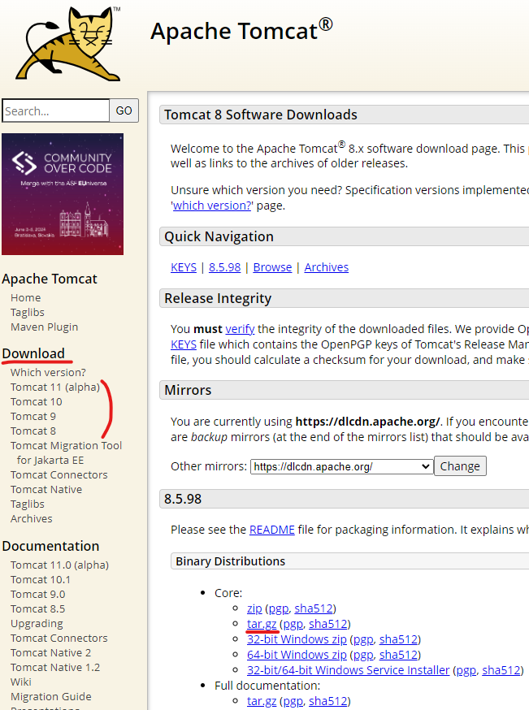

# Tomcat

담당자: 강성민
진행 상태: 진행중
유형: 서버
마감일: 2024년 1월 28일
회차: 1

# Apache Tomcat


[아파치 톰캣](https://tomcat.apache.org/index.html)(이하 톰캣)은 아파치 소프트웨어 재단에서 개발한 서블릿 컨테이너, 웹 컨테이너 역할을 하는 웹 어플리케이션 서버(WAS)이다. 자바로 개발한 JSP와 자바 서블릿을 실행할 수 있는 자바 환경을 제공한다. 자바 또는 스프링을 이용해 개발한 웹 어플리케이션은 톰캣을 이용해야만 실행시킬 수 있으며, 스프링부트는 내부에 들어있는 내장 톰캣을 사용해 바로 실행할 수 있다.

## Tomca 구성

| 폴더명 | 용도 및 주로 사용하는 파일 |
| --- | --- |
| bin | 톰캣을 실행, 종료 시킬 .sh 스크립트 파일 등이 있다(bat은 윈도우용 실행 파일).<br>catalina.sh, startup.sh, shutdown.sh  |
| conf | 환경 설정을 위한 파일들이 있다.<br>server.xml |
| lib | 톰캣을 실행시키는데 필요한 라이브러리 파일들이 위치한다. |
| logs | 서버의 로그 및 설정에 따라 서버 접근 로그를 보관한다.<br>catalina.out, access_log.txt |
| temp | JVM이 사용하는 임시 파일을 보관한다. |
| webapps | 톰캣으로 실행시킬 웹 어플리케이션이 위치할 폴더로, 기본적으로 ROOT, docs, examples, host-manager, manager 폴더가 있다. ROOT, examples는 기본 톰캣 페이지 및 예시 사이트를 보여주며, host-manger, manager는 톰캣 서버를 관리할 관리자 사이트이다. 불필요하면 모두 삭제해도 된다. |
| work | 웹 어플리케이션을 배포할 때 임시 작업 공간으로 사용한다. |

### bin 폴더

주로 catalina.sh 파일을 사용하며, ‘sh catalina.sh {명령어}’ 의 형식으로 사용한다. 주로 start, stop 명령어를 사용하여 톰캣을 실행하거나 종료하는데, startup.sh, shutdown.sh 을 대신 사용해도 된다.

catalina.sh 의 내부를 살펴보면 여러 환경변수를 사용하는데, 사용자가 일부 변수를 지정할 경우 이 파일 대신 setenv.sh 파일을 생성하여 관리하면 편리하다. setenv.sh 파일은 catalina.sh가 실행될 때  먼저 읽혀 변수값을 설정한다.

### conf/server.xml

- 기본 설정 예시

```xml
<?xml version="1.0" encoding="UTF-8"?>
<Server port="8005" shutdown="SHUTDOWN">
  <Listener className="org.apache.catalina.startup.VersionLoggerListener" />
  <Listener className="org.apache.catalina.core.AprLifecycleListener" SSLEngine="on" />
  <Listener className="org.apache.catalina.core.JreMemoryLeakPreventionListener" />
  <Listener className="org.apache.catalina.mbeans.GlobalResourcesLifecycleListener" />
  <Listener className="org.apache.catalina.core.ThreadLocalLeakPreventionListener" />
  <Service name="Catalina">
    <Connector port="8080" protocol="HTTP/1.1"
               connectionTimeout="20000"
               redirectPort="8443"
               maxParameterCount="1000"
               />
		<!--
		<Connector port="8443" protocol="org.apache.coyote.http11.Http11AprProtocol"
               maxThreads="150" SSLEnabled="true"
               maxParameterCount="1000"
               >
        <UpgradeProtocol className="org.apache.coyote.http2.Http2Protocol" />
        <SSLHostConfig>
            <Certificate certificateKeyFile="conf/localhost-rsa-key.pem"
                         certificateFile="conf/localhost-rsa-cert.pem"
                         certificateChainFile="conf/localhost-rsa-chain.pem"
                         type="RSA" />
        </SSLHostConfig>
    </Connector>
		-->
    <Engine name="Catalina" defaultHost="localhost">
      <Host name="localhost"  appBase="webapps"
            unpackWARs="true" autoDeploy="true">
        <Valve className="org.apache.catalina.valves.AccessLogValve" directory="logs"
               prefix="localhost_access_log" suffix=".txt"
               pattern="%h %l %u %t &quot;%r&quot; %s %b" />
      </Host>
    </Engine>
  </Service>
</Server>
```

- Server : server.xml 파일의 전체를 감싸는 태그. 톰캣을 종료시킬 shudown 포트를 8005로 지정하고 있다.
- Service : 1개 이상의 Connector를 갖고 있으며, 1개 이상 존재할 수 있다. Service 하위에 구성된 여러 요소를 총합하여 실질적으로 1개의 서비스를 나타낸다.
- Connector : Service 안에 여러개 존재할 수 있다. 외부의 **요청**을 지정한 **프로토콜**로 받을 **포트** 및 추가 설정을 지정한다. 위에선 8080 포트로 HTTP 요청을 받는다.
    - 주석 처리한 Connector는 8443 포트로 HTTPS 요청을 받는 설정이다. Certificate의 옵션값으로 유효한 인증서 설정이 필요하다.
    - 8080 포트 Connector의 redirectPort 설정은 8443 포트로 요청을 넘기는 것으로, **HTTP 요청을 HTTPS 로 리다이렉트** 시키는 역할을 한다.
- Engine : 1개 이상의 Connector 에서 전달받은 요청을 처리하고 응답을 다시 전달해준다. 하위에 Host 를 1개 이상 둘 수 있어, 각기 다른 Host 요청에 컨텍스트(웹 어플리케이션)를 지정해줄 수 있다. 만약 Host에 매핑되지 않는 요청이 들어오면 defaultHost 에 지정된 Host가 요청을 처리한다.
    - Engine의 name은 로그나 에러 메시지에 사용되며 한 Server 하위에 유일한 값을 사용해야 한다.
- Host : 여러가지 옵션이 있어 하위의 Context 와 더불어 어떤 컨텍스트를 배포하고 패스를 매핑해줄지 설정한다.
    
    
    | 옵션 | 설명 |
    | --- | --- |
    | name | 요청으로 들어올 host를 지정한다. |
    | appBase | 배포할 컨텍스트의 경로를 지정한다. CATALINA_BASE 기준으로 상대 경로를 지정할 수 있으며, 절대 경로를 사용해도 된다. 기본적으로 appBase의 모든 웹 어플리케이션이 배포된다. |
    | unpackWARs | true일 경우 appBase의 WAR 파일을 폴더명으로 풀어서 배포한다. false일 경우 압축을 풀지 않고 바로 배포가 되나, 성능상 손해가 있다. (기본값 : true) |
    | autoDeploy | true일 경우 appBase의 컨텍스트들의 변화를 감지하여 리로드 또는 재배포를 한다. 리로드를 하는 경우엔 유저 세션이 유지 되지만, 재배포는 세션을 유지하지 않는다. (기본값 : true) |
    | deployIgnore | autoDeploy 또는 deployOnStartup 의 속성에 의해 배포되는 컨텍스트에 정규 표현식으로 표현하여 예외를 설정한다.<br>예) foo와 관련된 foo.war, foobar 등의 파일 또는 디렉토리를 배포하지 않으려면, ‘.*foo.*’ |
    | deployOnStartup | 톰캣 실행 시 이 Host의 내용을 배포할 것인지 설정한다. (기본값 : true) |
- Context : Host 안에서 각 웹 어플리케이션을 나타낸다. WAR 파일 또는 압축이 풀린 디렉토리와 매핑된다. Context로 지정하지 않으면 각 어플리케이션의 META-INF/context.xml 에 의해 name과 path가 자동으로 설정된다. Host에서 각 요청은 컨텍스트의 path 중 가장 긴 값과 매칭되는 컨텍스트로 처리된다. path를 빈값(””)으로 설정할 경우 디폴트 path로 매핑되며 ROOT 폴더와 매핑된다.
    - 예)
        - 컨텍스트A : /hello, 컨텍스트B : /hello/world
        - 요청 : /hello/world/abc
        - ⇒ 컨텍스트A, B 모두 path가 일치하지만 B의 path가 더 길어 B가 요청을 처리

### 자동 배포의 주의점

Host에서 deployOnStartup 또는 autoDeploy 옵션을 사용할 경우 Context의 docBase 경로가 appBase에 포함되면 안된다. appBase, docBase의 내용이 각각 배포되어 웹 어플리케이션이 2번 배포된다.

이를 막기 위해 아래의 방법을 사용할 수 있다.

- docBase를 appBase 외부로 설정
- deployIgnore 로 docBase 를 자동 배포되지 않도록 설정

## Tomcat의 환경 변수 - CATALINA_HOME, CATALINA_BASE

톰캣의 환경 변수명은 대부분의 소프트웨어처럼 ‘TOMCAT_’으로 시작하지 않고 ‘CATALINA_’으로 시작한다.

- CATALINA_HOME : 톰캣이 **설치**된 root 경로.
- CATALINA_BASE : 톰캣을 실행시킬 때 필요한 설정값들의 root 경로.

톰캣은 CATALINA_BASE 위치의 환경설정을 읽어 CATALINA_HOME 위치의 바이너리 파일을 사용하여 톰캣 인스턴스를 실행시킨다.

기본적으로 CATALINA_HOME과 CATALINA_BASE는 동일한 경로를 가리킨다. CATALINA_HOME에는 기본값으로 사용할 설정값들이 모두 포함되어있기 때문이다. 상황에 따라 설정 파일을 다른 곳에 두어 CATALINA_BASE 값을 다르게 설정하여 사용할 수 있다.

만약 두 환경변수가 다른 곳을 가리킬 경우, 톰캣은 먼저 CATALINA_BASE에서 필요한 설정값들을 읽고, 없는 경우 CATALINA_HOME에서 읽어 톰캣 인스턴스를 실행시킨다.

## 여러 개의 웹 어플리케이션을 구성하는 방법

### 1. webapps 하위에 여러 웹 어플리케이션

- 여러개의 웹 서버가 하나의 톰캣 인스턴스에서 동작한다. 톰캣을 실행시키면 webapps의 모든 웹 서버가 배포되며, 각 폴더명으로 path가 매핑된다.
- 실행되는 모든 웹 서버가 동일한 포트와 매핑되므로 path 매핑으로만 구분이 가능하다.
- 배포할 웹 서버 지정과 매핑시킬 path는 server.xml에서 설정이 가능하다.
- 한 번에 여러 웹 서버를 실행시키거나 종료 시킬 수 있다.
- 각 서버의 로그 관리가 불편하고, 해당 톰캣 인스턴스에 문제가 생기면 모든 웹 서버가 모두 종료된다. 일부 웹 서버에 문제가 생겨

### 2. 웹 서버가 필요한 개수 만큼 톰캣 폴더 복사

- 하나의 웹 서버만 배포되도록 잘 설정된 톰캣 폴더 자체를 복사하여, 각각의 웹 서버를 실행시킬 전용 톰캣 폴더를 구성한다. 여러개의 톰캣 인스턴스가 실행된다.
- 각각의 웹 서버들은 서로 다른 포트와 매핑된다.
- 웹 서버에 접근할 포트는 서로 같을 수 없지만, 서버를 종료시킬 SHUTDOWN 포트는 같을 수도 있으므로 겹치지 않도록 주의가 필요하다.
- 1번 방법과 달리 웹 서버별로 인스턴스와 로그가 구분된다. 실행시킬 웹 서버 만큼 톰캣을 실행시켜야 하지만, 필요한 서버만 지정하여 실행 시킬 수 도 있고, 필요한 경우 여러 톰캣을 한번에 실행시키거나 종료시킬 스크립트를 만들어 사용할 수도 있다.
- 각 톰캣의 버전이나 톰캣 바이너리 파일 등을 각 폴더별로 다르게 구성하지 않을 경우, 불필요한 용량을 차지하며, 공통적으로 사용하는 설정들도 각 폴더에 모두 일일이 설정해야하는 단점이 있다.

### 3. **웹 서버가 필요한 개수 만큼 CATALINA_BASE 구성**

- 톰캣이 설치된 폴더는 CATALINA_HOME로 공통으로 사용하고, 각 웹 서버에 필요한 설정을 갖는 폴더는 CATALINA_BASE로 구분하여 구성한다.
- 각각의 웹 서버들은 서로 다른 포트와 매핑된다.
- 각 웹 서버에 필요한 설정들만 따로 분리할 수 있으며, 공통적인 설정들은 CATALINA_HOME에 두어 관리에 용이하다.
- 각 CATALINA_BASE는 conf 하위의 server.xml, web.xml 파일, webapps 하위의 파일들을 필수적으로 가져야하며, 다른 파일들은 선택적으로 사용하면 된다.
- 특히 각 웹서버 실행 시 사용하는 자바 옵션 값들은 bin 하위에 setenv.sh 파일을 두어 관리하므로 디폴트 값을 CATALINA_HOME의 bin 하위에 두고 다른 값을 사용할 때 CATALINA_BASE에는 선택적으로 필요한 값을 둘 수 있다.
- CATALINA_BASE 지정하여 톰캣 실행 예제 (종료 시에도 같은 방식으로)

```bash
CATALINA_BASE={BASE 폴더경로} {HOME 폴더경로}/startup.sh
# 또는
export CATALINA_BASE={BASE 폴더경로}
{HOME 폴더경로}/startup.sh
```

## Tomcat 설치

톰캣은 패키지로 제공되지 않는다. 소스를 직접 컴파일하거나 바이너리 패키지를 바로 사용하면 되는데, 여기서는 편의상 바이너리 패키지를 사용한다.

- Download 목록에서 원하는 버전 선택
- 상세 페이지의 Binary Distributions에서
    - tar.gz를 직접 다운받아 리눅스 서버에 넣거나,
    - tar.gz 링크를 복사하여 리눅스에서 `wget {링크}` 로 리눅스 현재 경로에 직접 다운로드



```bash
# 링크를 복사하여 직접 다운로드
wget https://dlcdn.apache.org/tomcat/tomcat-8/v8.5.98/bin/apache-tomcat-8.5.98.tar.gz
# tar 압축풀기
tar -xvf apache-tomcat-8.5.98.tar.gz
# apache-tomcat-8.5.98 라는 폴더에 톰캣 설치 완료
```

# 참고

톰캣

- 톰캣 8 docs : [https://tomcat.apache.org/tomcat-8.5-doc/introduction.html](https://tomcat.apache.org/tomcat-8.5-doc/introduction.html)